# KnitSpace

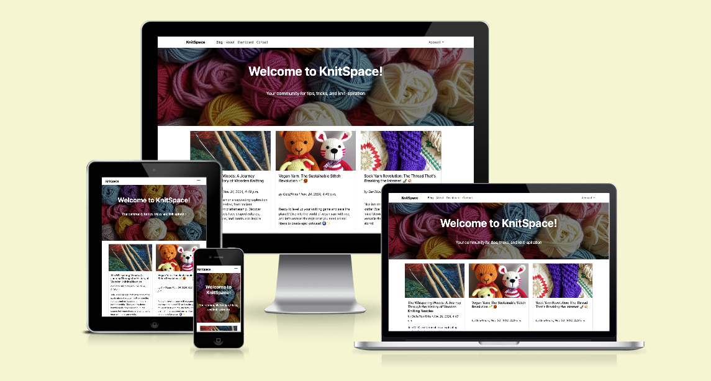

KnitSpace is a vibrant online community for knitters of all levels to share, learn, and connect. Users can browse blog posts on various knitting-related topics without logging in. They can also create an account to save their favourite posts or create their own.

Visit the deployed application [here](https://knit-space-57239e7d6ce8.herokuapp.com/).

## Table of Contents

1. [Project Planning](#project-planning)
    1. [Agile Methodology](#agile-methodology)
    2. [CRUD Functionality](#crud-functionality)
    3. [Entity Relationship Diagram](#entity-relationship-diagram)
2. [Design Choices](#design-choices)
    1. [Color Palette](#color-palette)
    2. [Typography](#typography)
    3. [Wireframes](#wireframes)
    4. [Pre-existing posts](#pre-existing-posts)
3. [User Experience (UX)](#user-experience-ux)
   1. [Project Goals](#project-goals)
   2. [User Stories](#user-stories)
4. [Features](#features)
   1. [General](#general)
   2. [Pages](#pages)
   3. [Content Management](#content-management)
   4. [User Authentication](#user-authentication)
   5. [Future Features](#future-features)
5. [Technologies Used](#technologies-used)
   1. [Languages](#languages)
   2. [Tools](#tools)
   3. [Libraries, Frameworks, and Packages](#libraries-frameworks-and-packages)
   4. [Tools and Programs](#tools-and-programs)
6. [Deployment](#deployment)
   1. [GitHub](#github)
   2. [Heroku](#heroku)
7. [Testing](#testing)
8. [Finished Product](#finished-product)
9. [Credits](#credits)
   1. [Content](#content)
   2. [Media](#media)
   3. [Code](#code)
10. [Acknowledgements](#acknowledgements)

## Project Planning 

### Agile Methodology

Agile methodology played a crucial role in managing the development process. The project was divided into smaller sprints, each focusing on adding a specific feature or improving an existing function.
 
The first sprint focused on setting up a basic blog application, which formed the project's foundation. The application allows users to browse through post previews and open the full post by clicking on the preview. Users are not required to log in to the site to view posts. 
 
The second sprint focused on implementing user authentication. Once implemented, it allows users to create an account using their email address and log into and out of the account. After future sprints, logged-in users can access exclusive areas of the blog.
 
The third sprint focused on setting up the Dashboard and its functionality. The Dashboard serves as a space for registered users to view their favourite posts. Posts can be saved and removed from the Dashboard via a button and rearranged with a drag-and-drop feature. Due to time constraints, the functionality to reorder blog posts was moved into the next sprint.
 
The fourth sprint focused on completing the drag-and-drop functionality and adding additional user functions. Logged-in users can create blog posts, including custom images, and edit and delete their posts after creation.
 
The fifth sprint focused on adding an *About* page to the blog to allow users to connect with its fictional host.
 
The sixth sprint focused on enhancing the user experience by improving existing features and addressing issues that had become apparent during testing. Some examples include:
- A *My Posts* page was created, allowing users to manage all their posts comfortably in one place.
- Messages after saving, updating, or deleting a post were added to provide users with immediate feedback on their actions.
- A confirmation modal was added before posts are permanently deleted to avoid accidental deletions that cannot be undone.
- Custom pages for the two most common errors encountered during production - 404 and 404 - were created.

The seventh sprint focused on adding a contact form to allow users to contact the site owners. No login information is required to access this page. Submitted contacts can be managed from the */admin* panel. In the same sprint, the ability to update the *About* page was included in the */admin* panel.

Although no *Issues* were created for this, the final sprint focussed on polishing the project for deployment. Code validation was performed alongside a final round of compatibility and feature testing.

GitHub Projects was an essential tool for tracking progress and managing tasks throughout the Agile development process. A Kanban-style board was used to track progress visually. Each issue was based on a user story and moved through the different phases of *To Do*, *In Progress*, and *Done*, following the corresponding sprints. 
Custom labels were created to distinguish the issues visually. Labels were used to assign a priority - *must-have*, *should-have*, *could-have* or *will-not-have*, based on the MOSCOW model of prioritization -  as well as a functionality - *C*, *R*, *U*, or *D*, to reference their role within the *CRUD* functionality.

### CRUD Functionality

*CRUD* functionality has been implemented throughout the project to create an entirely usable experience for the user.

Admin (superuser only)
- *C*: Create new users and posts.
- *R*: Read or view all users and posts.
- *U*: Update posts and user information.
- *D*: Delete posts and users.

Dashboard (logged-in users only)
- *C*: Create a new entry by saving a post to the Dashboard.
- *R*: View all saved posts and open them in full-page view.
- *U*: Update the order of the posts via drag and drop.
- *D*: Delete a post from the Dashboard.

Content Management (logged-in users only)
- *C*: Create a new post.
- *R*: View newly created and previous posts (guest users can view all posts).
- *U*: Update own blogposts.
- *D*: Delete own blogposts.

**Note**: The *CRUD* functionality for content management has been implemented in multiple places. Users can update and delete their posts from the *My Post* section and the full-page view of each post. Users can also create a new post from their account menu and the *My Post* section.

### Entity Relationship Diagram

During planning, [Lucidchart](https://www.lucidchart.com) was used to visualize the relationships between the models in this application. The relationships are between *User*, *BlogPost*, and *SavedPost*. *About* is an independent entity with no relation to the other models.

 Entity Relationship Diagrams Image

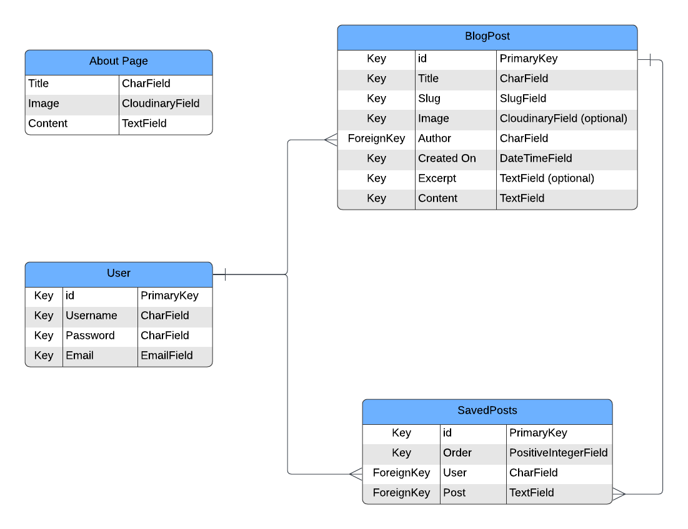

#### User Entity
User -> BlogPost:
- Each User can be the author of multiple *BlogPost* instances. This represents a one-to-many (1:N) relationship where the *User* is on the "one" side, and each *BlogPost* is on the "many" side.
- In the model, this relationship is facilitated by a ForeignKey in the *BlogPost* model pointing to the *User*.

User -> SavedPost:
- Each User can save multiple blog posts, resulting in several *SavedPost* entries. This is another one-to-many (1:N) relationship.
- This is implemented via a ForeignKey in the *SavedPost* model, which points back to the user.

#### BlogPost Entity
BlogPost -> User:
- A *BlogPost* is authored by the *User*, which is a many-to-one relationship where multiple *BlogPost* instances can be associated with a single *User*.

BlogPost -> SavedPost:
- Each BlogPost can be saved by multiple users, represented by various SavedPost entries. This defines another one-to-many (1:N) relationship, where *SavedPost* serves as an intermediary.

#### SavedPost Entity
BlogPost -> User:
- This is a many-to-one relationship, illustrating that multiple saved posts can belong to a single user.

BlogPost -> SavedPost:
- This is a many-to-one relationship, indicating that multiple users can save the same blog post.

### Design Choices

#### Color Palette

The color palette uses three colors taken from the header image to maintain a consistent style, as well as standard white. The colors were chosen for their pastel look to help create a pleasant and soothing experience for the user. Only three colors were used to support that experience. The palette was generated using [Coolors](https://coolors.co/image-picker).
- #FFFFFF (white): Cards and input fields are white to stand out.
- #FAF9F6 (baby powder): This was chosen as a background for the site to create a softer look. 
- #CDBABE (thistle): This was chosen for the header and footer to frame the page content visually. 
- #538EA3 (blue / munsell): This was chosen for the site's buttons.

 Color Pallette Image

#### Typography

Fonts were paired and imported using [Google Fonts](https://fonts.google.com).
*Sigmar* was chosen as the font for the logo and the header text due to its bold, decorative lettering. For the main text, *Poppins* was used, as it offers a clean, modern design that is easy to read in various styles and sizes.

 Type Font Images

 Sigmar

 
 

 Poppins

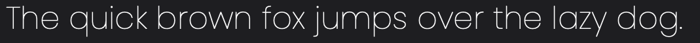

#### Wireframes

[Balsamiq](https://balsamiq.com/) was used to create wireframes for each page to display their appearance on both mobile and larger devices.

Page | Desktop Version | Mobile Version
--- | --- | ---
Home | 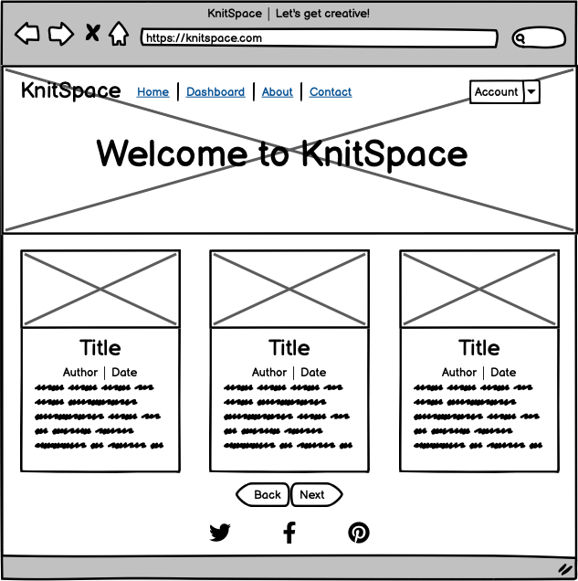 | 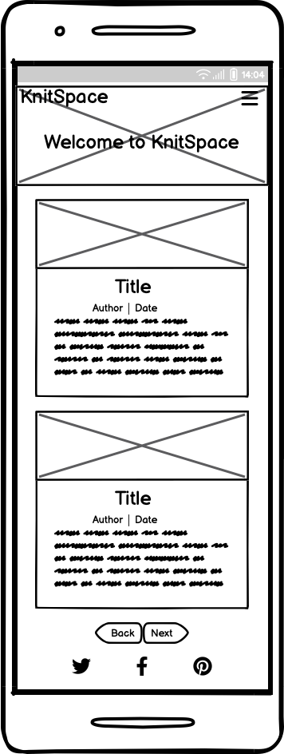
About | 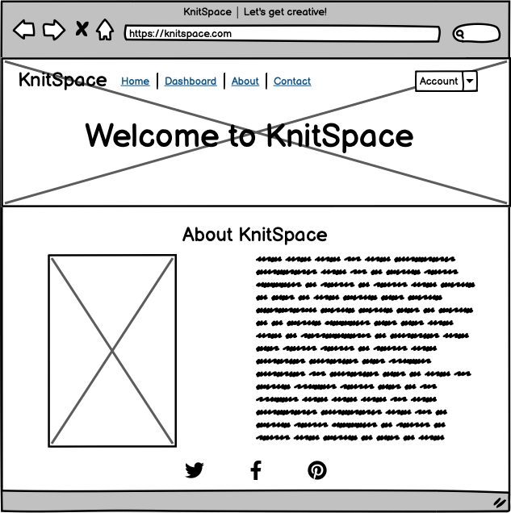  | 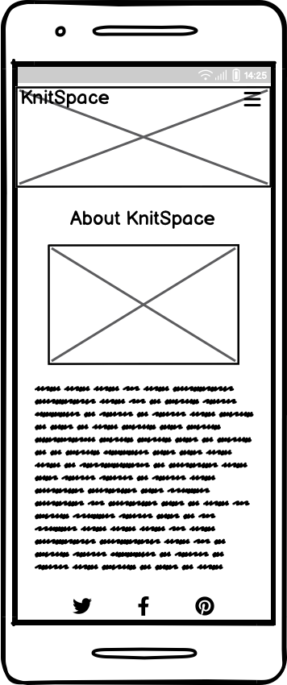
Contact Us | 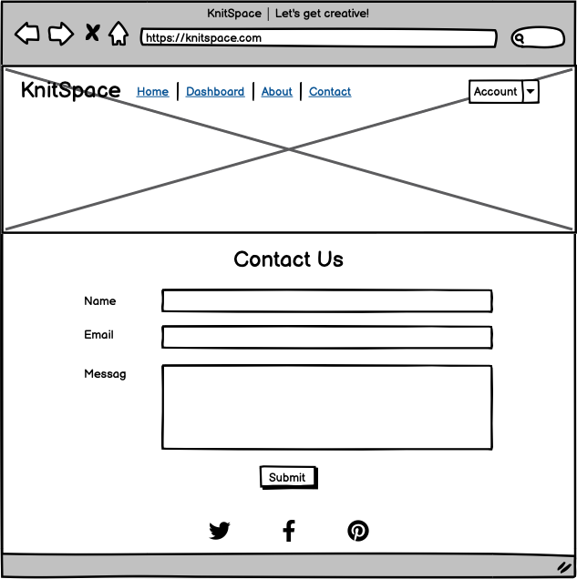 | 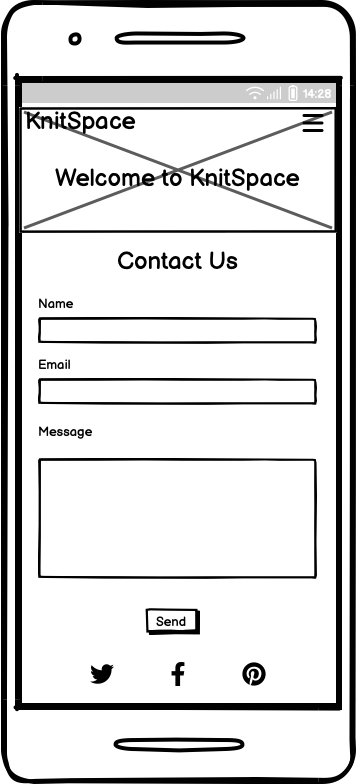
Dashboard | 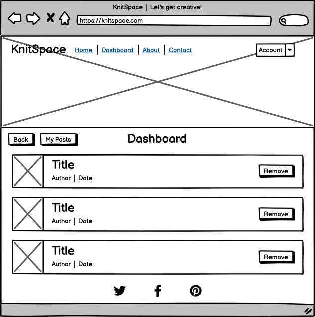 | 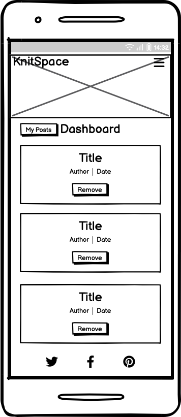
My Posts | 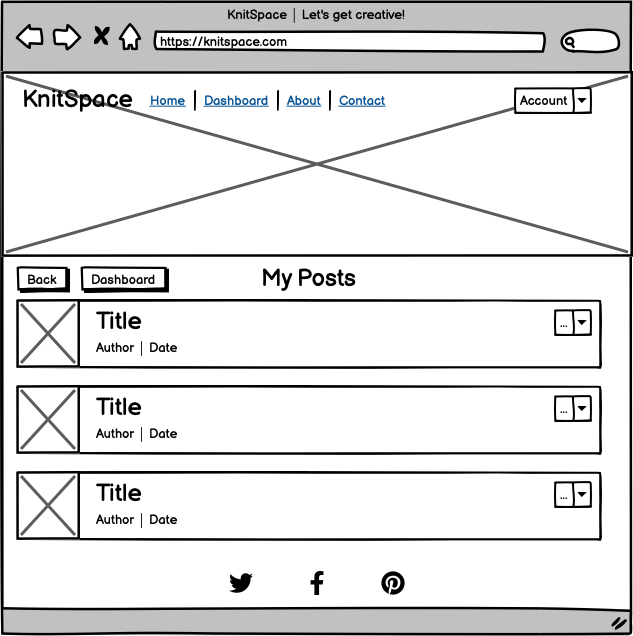 | 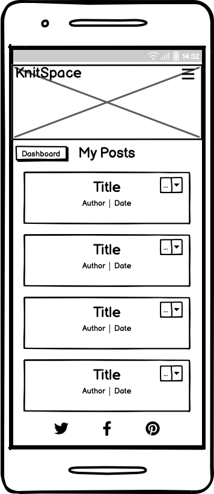
Blog Post View | 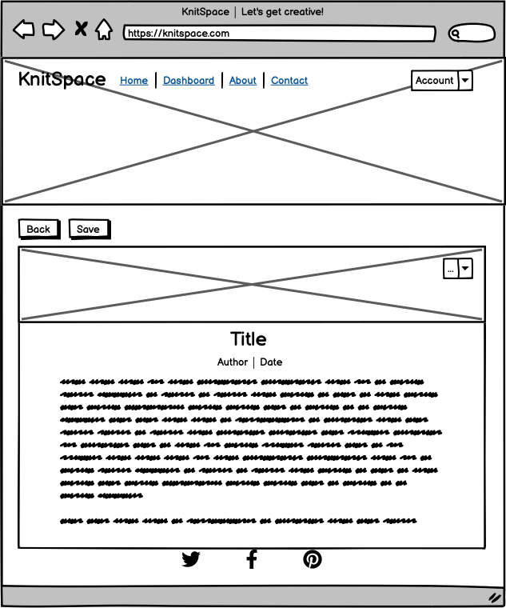 | 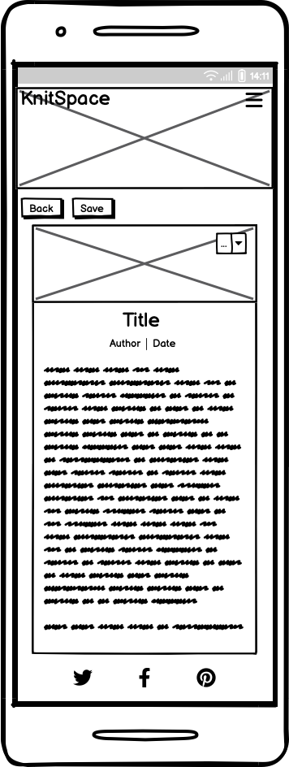
Edit Post | 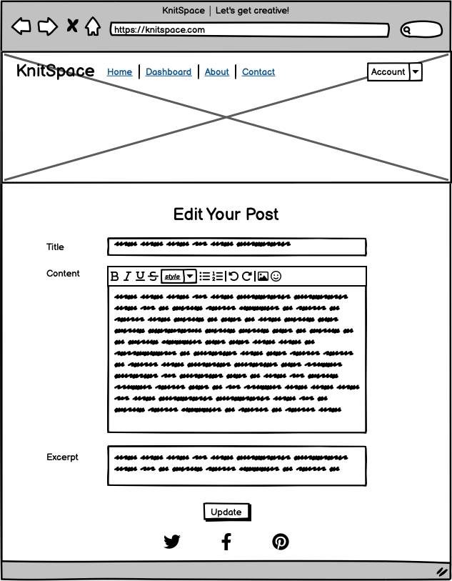 | 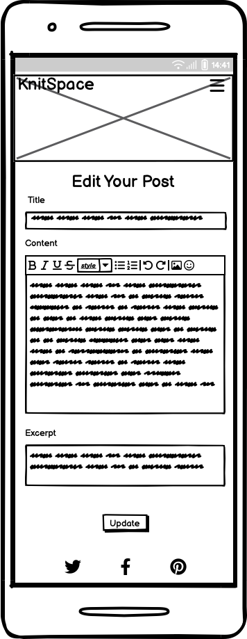
Create Post | 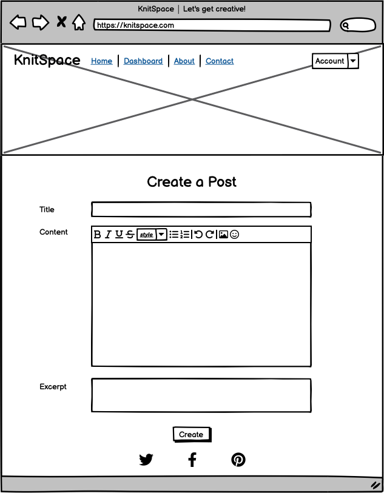 | 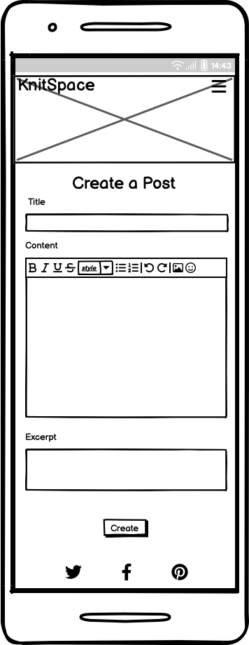
Sign In | 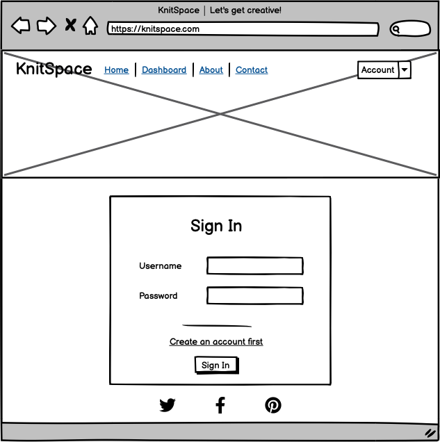 | 
Sign Up | 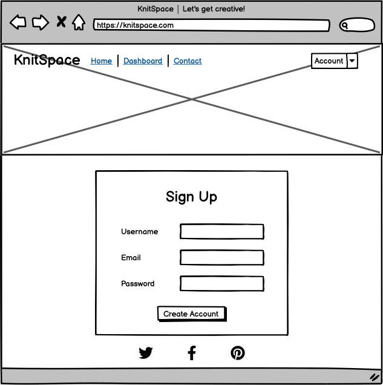 | 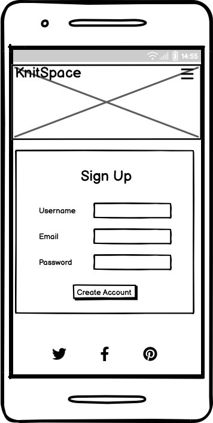
Sign Out | 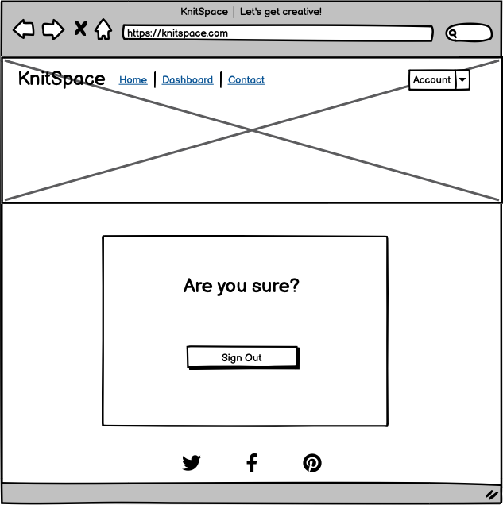 | 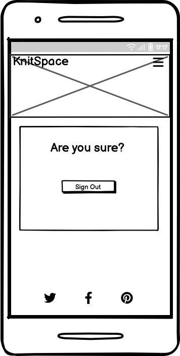
Error Page | 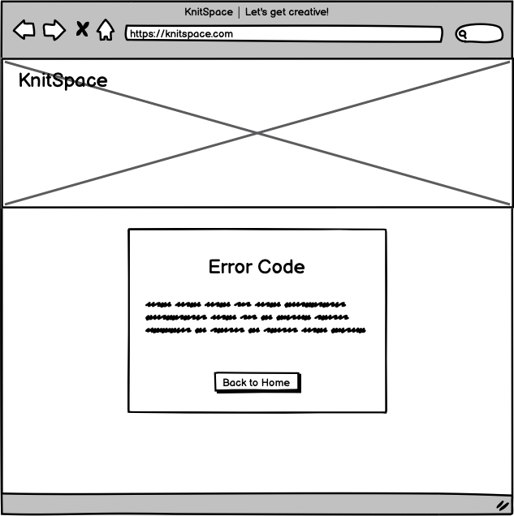 | 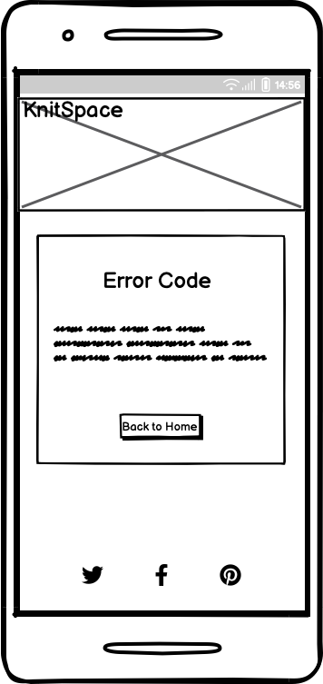

#### Pre-existing Posts

In order to create a realistic, immersive feeling for new users, a total of 30 blog posts have been designed and uploaded into the database as a .json file. These posts were created with six user personas in mind and were given various created_on dates to make a well-established blog appear. Posts were initially supposed to be displayed by their last_modified rather than their created_on date. However, frequent testing and updates throughout the process meant that these dates were much closer together than initially anticipated. To maintain the feeling of a pre-existing blog, the decision was made to order posts by their created_on date instead.

[Back to top ⇧](#knitspace)

## User Experience (UX)

### Project Goals

- The project incorporates a responsive design across different devices.
- The project provides an intuitive structure and navigation.
- The project has a pleasant, coherent design that invites users to participate in the community.
- The project allows users to register and access their accounts.
- The project provides exclusive content to registered users.
- The project incorporates full *CRUD* functionality so the user can interact with the content.
- The user allows users to contact the site owners for questions and concerns.

### User Stories

#### Blog Accessibility

- As a **guest user**, I can **view blog posts without the need to log in or register** so that **I can freely access content on the site**.
- As a **guest user**, I can **click on a post preview** so that **I can open the full post and read it in detail**.
- As a **registered user**, I can **access exclusive content** so that **I can engage with the community and share information**.

#### Account Management

- As a **guest user**, I can **create an account** so that **I can have a personalized experience and access member-only features.**.
- As a **registered user**, I can **log in to my account** so that **I can access my Dashboard and other member-only features**.
- As a **registered user**, I can **log out of my account** so that **I can ensure my account security and privacy**.

#### Dashboard Management

- As a **registered user**, I can **save posts to my dashboard** so that **I can easily access my favorite content**.
- As a **registered user**, I can **rearrange my saved posts** so that **arrange my content board according to my preferences**.
- As a **registered user**, I can **delete saved blog posts from my Dashboard** so that **I can manage my content board**.
- As a **registered user**, I can **click on a saved post preview** so that **I can open the full post and read it in detail**.

#### Content Management

- As a **registered user**, I can **create a new blog post** so that **I can share my knitting experiences and tips with the community**.
- As a **registered user**, I can **update my existing blog posts** so that **I can correct or update the content I have shared with the community**.
- As a **registered user**, I can **delete my blog posts** so that **I can remove content that I no longer want to share with the community**.
- As a **registered user**, I can **access and manage all my authored posts from a central page** so that **I can efficiently maintain and update my content**.

#### Engagement and Information
- As a **guest user**, I can **submit a contact form** so that **I can communicate with the support team for inquiries or feedback**.
- As a **guest user**, I can **learn about Frau Wolle's knitting journey and experiences** so that **I feel connected to the community and inspired to engage with the content**.

[Back to top ⇧](#knitspace)

## Features

### General

#### Header and Navigation

The header is the same across all pages to provide users with a familiar layout and allow them to focus on the content of each page. It contains the KnitSpace logo in the top left, doubling as a Home Page link. It also includes links to all website pages across the top, which will take on a different color when active.
The header includes the main background image, which displays a welcome message across the home page. However, this message disappears on the other pages.

 Header Images

 Header Image Guest User

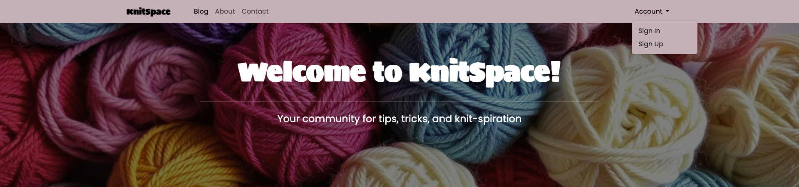
 
 

 Header Image Registered User

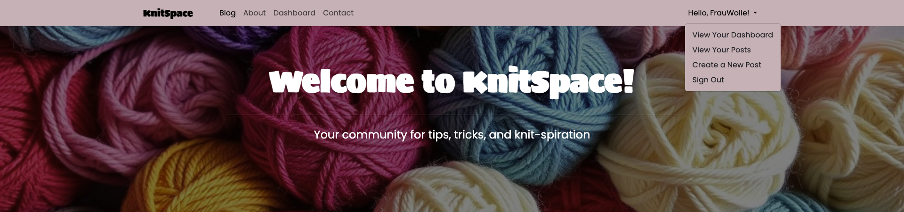

#### Footer

The footer is the same across pages to provide users with a familiar layout and allow them to focus on the content of each page. It contains links to social media networks, which will open a new tab when clicked, and a copyright declaration.

 Footer Image 

### Pages

#### Home

The *Home* page previews all available blog posts, ordered from most to least recent. Each post is presented in a clickable card that opens the full-page view. Each card contains an image at the top, which defaults to a preset image unless changed by the user when creating a post, followed by the author, date, and, lastly, the excerpt, if available.
Arrows at the bottom of the page allow users to browse between multiple pages.

 Home Page Image 

#### Post Previews & Detail Views

Post previews are displayed as cards showing an image, the post's title, the author and creation date, and an excerpt. Images are optional; a default image is displayed if users choose not to upload a custom image.

When clicking on a blog post preview card, a full-page view opens. This view presents the user with the post's title, author, date, and full text. A *Back* button above the post allows users to return to the *Home* page. Additionally, for logged-in users, a *Save* button above the post will enable users to save their favorite posts to their Dashboard. The author of each post also sees a drop-down menu allowing them to edit or delete their posts. A confirmation modal prevents users from accidentally deleting posts.

 Post Previews Image 

 Default Image on the Right 

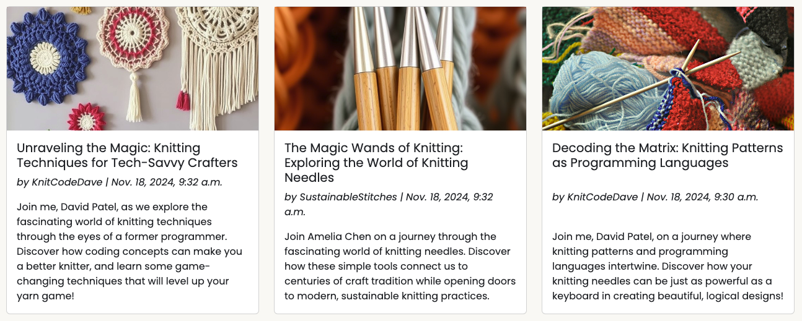

 Post Details Images 

 Post Details - Guest User

 
 

 Post Details - Registered User

 
 

 Post Details - Post Author

 
 

 Post Details - No Image Provided

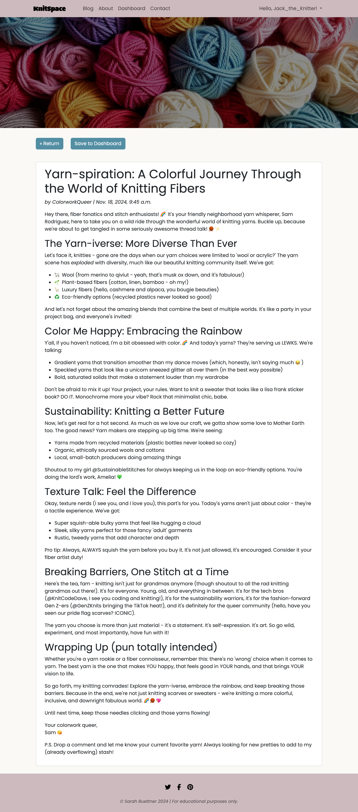
 
 

 Post Details - Confirmation Modal

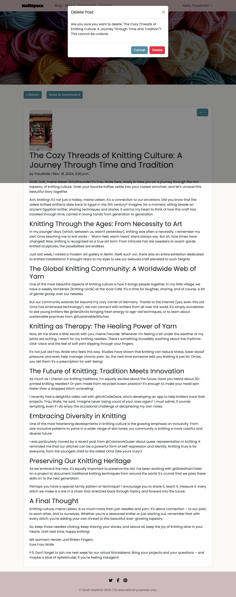
 
 

 Post Details - Confirmation Message

#### User Dashboard

The Dashboard lets users view all their saved posts in one continuous list. A link to the Dashboard only appears for logged-in users. Each post is presented as a more condensed version of the post preview and will open the full-page post when clicked. Users can delete their saved posts from their Dashboard anytime and rearrange them using drag-and-drop functionality.

 Dashboard Images 

 Dashboard Image - No Saved Posts 

 
 

 Dashboard Image - Saved Posts 

 
 

 Dashboard Image - Confirmation Message 

#### My Posts

This page lets users easily view and manage all the posts they have authored in one place. Posts appear here after they are created and disappear from the blog when deleted. A confirmation modal prevents users from accidentally deleting posts.

 My Posts Images 

 My Posts - No Posts

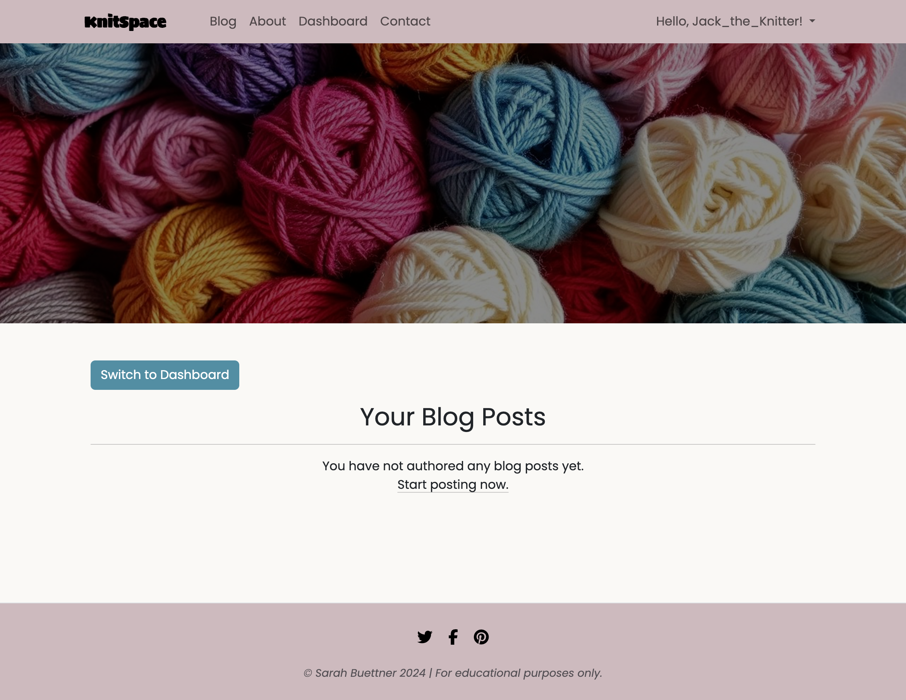
 
 

 My Posts - Posts

 
 

 My Posts - Confirmation Modal

 
 

 My Posts - Confirmation Message

#### About

The *About* page lets users learn more about Frau Wolle, the face and hands behind KnitSpace. It consists of an image and a short biography which invites users to connect with her.

 About Page Image 

#### Contact Us

The *Contact Us* page allows users to send a message to the site owner. After successful submission, a confirmation message is displayed to the user.
 
The message can be viewed by the superuser in Django's */admin* section.

 Contact Us Page Images 

 Contact Us 

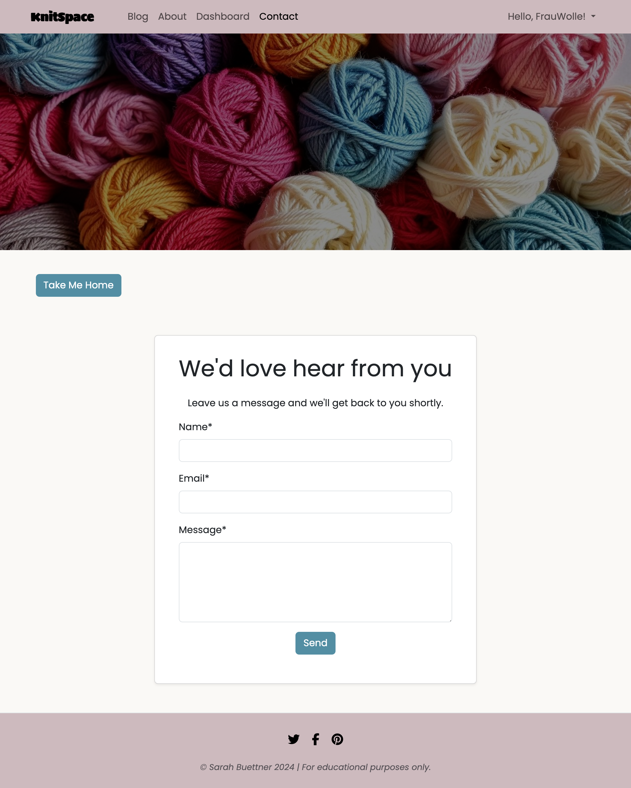
 
 

 Contact Confirmations 

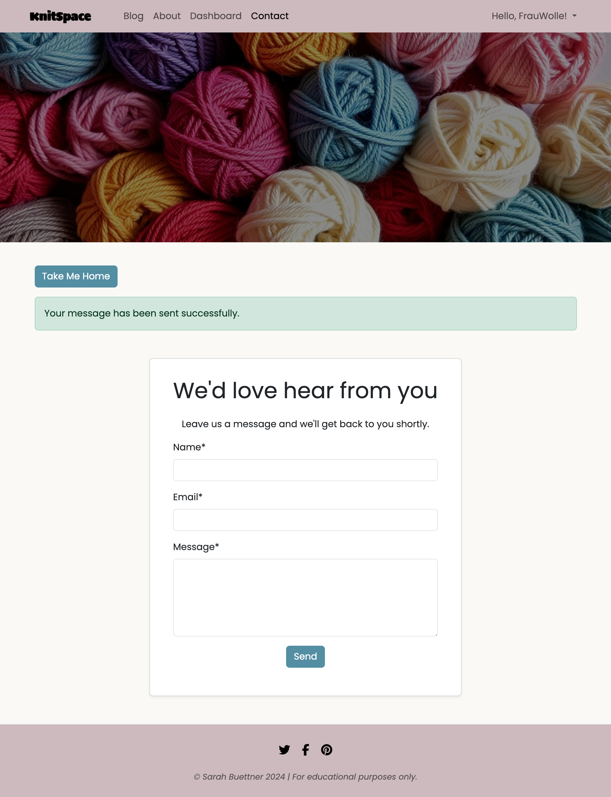

#### Error Pages 

The *404* page is displayed when an invalid or incorrect URL is entered.
 
The *500* is displayed when an internal server error occurs.
 
Both pages are identical except for the error code they state. The clickable logo in the header and a clickable link in the content card allow the user to return to the home page.

 404 Page Image 

### Content Management

After logging in, users can create new posts. A blank form is rendered where they can input all relevant information. Optional fields are marked as such with a muted text comment.
 
Posts can be updated at any time. Users can change any information associated with the post, as long as the title remains unique. The form loads with the original content in prepopulated fields when updating a post. 

 Post Management Images 

 Create a Post 

 
 

 Update a Post 

 
 

 Update Confirmation 

### User Authentication

Users can create an account using their email address. Their username must be unique, and their chosen password must meet the standard safety criteria. No verification email is sent out by email.
 
After successfully creating an account, users can use their credentials to log into the page and access exclusive content, such as their dashboards. When finished, users can log out of their account to return to the guest view.

 User Authentication Images 

 Sign Up Image 

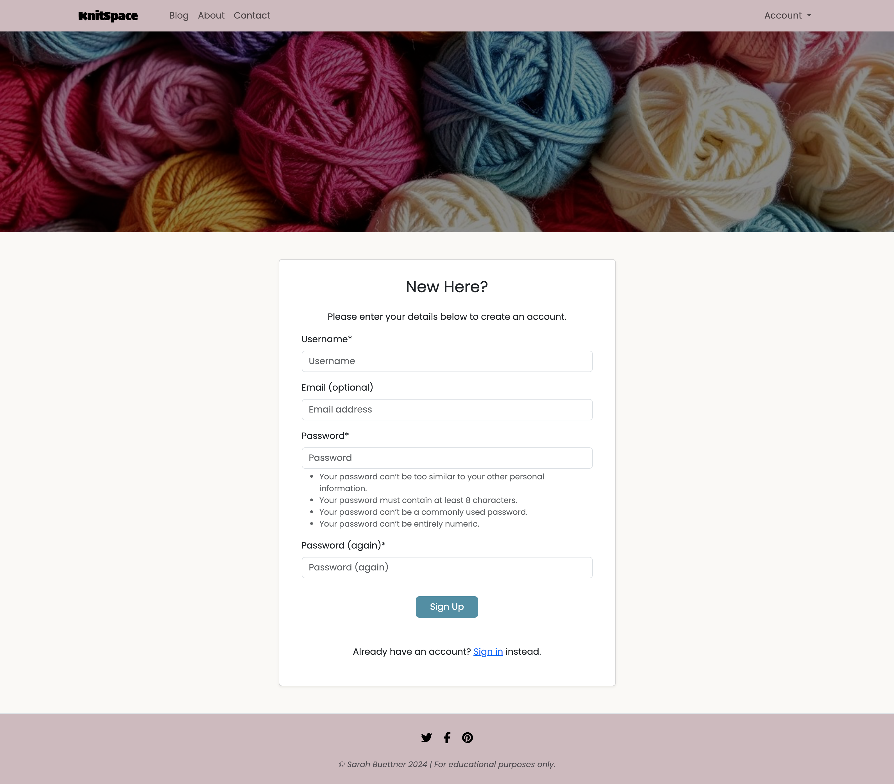
 
 

 Sign In Image 

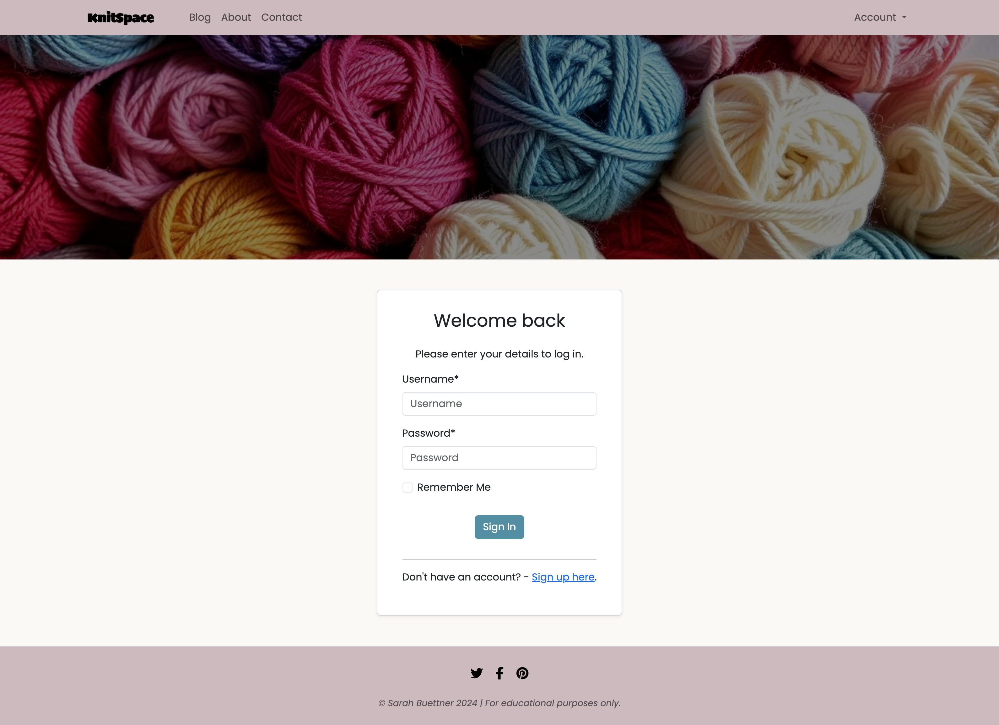
 
 

 Sign Out Image 

### Future Features

#### Comments
- Registered users can add comments to a blog post and respond to another comment made on a blog post.
- Registered users can participate in forum discussions.
- Registered users can view, update, and delete their comments when they are logged in.
- Guest users will be able to view existing comments.

#### Confirmation Emails & Password Reset
- When creating an account, users are sent a confirmation email.
- When logging in, users can reset their password via email.
- Users can log in using other accounts such as Facebook or Google.

#### User Profiles
- Users can access their profile from the account menu.
- Users can update and add to their personal information.
- Users can delete their accounts.

#### Search Bar & Filters
- Users can search the contents of the blog to find what they are looking for.
- Users can apply filters to the blog posts on the home page, their Dashboard, and their *My Post* page to customize their view based on their needs.

#### Contact Management
- Superusers can respond to incoming contacts through a platform like [Mailtrap](https://mailtrap.io/).

[Back to top ⇧](#knitspace)

## Technologies Used

### Languages

- [HTML5](https://en.wikipedia.org/wiki/HTML5)
- [CSS3](https://en.wikipedia.org/wiki/CSS)
- [Javascript](https://en.wikipedia.org/wiki/JavaScript)
- [Python](https://en.wikipedia.org/wiki/Python_(programming_language))

### Tools

### Libraries, Frameworks, and Packages

- [Django](https://www.djangoproject.com/) was used as web framework.

- [Django Template](https://jinja.palletsprojects.com) was used as a templating language for Django to display backend data to HTML.
   
- [Bootstrap 5](https://getbootstrap.com/docs/5.0/getting-started/introduction/) was used to help with styling and responsiveness.

- [Google Fonts](https://fonts.google.com) was used to import the fonts into the HTML file and use them throughout the site.

- [Font Awesome](https://fontawesome.com) was used throughout the website to add icons for aesthetic and UX purposes. 

- [Django Allauth](https://django-allauth.readthedocs.io/en/latest/) was used for user authentication, registration, and account management.
 
- [Gunicorn](https://gunicorn.org/) was used as a Python WSGI HTTP Server for UNIX to support the deployment of the Django application.  

- [Summernote](https://summernote.org/) was used as a WYSIWYG editor.

- [Heroku Postgres](https://www.heroku.com/postgres) was used in production as a service based on PostgreSQL provided by Heroku.

- [Cloudinary](https://cloudinary.com/) was used as an image storage solution.

- [jQuery](https://jquery.com/) was used as a JavaScript library to simplify the JavaScript code.

- [jQuery UI](https://jqueryui.com/) and [jQuery UI Touch Punch](https://www.drupal.org/project/jquery_ui_touch_punch) were used to implement the drag-and-drop functionality on desktop and mobile devices.

- [Django Crispy Forms](https://django-crispy-forms.readthedocs.io/en/stable/index.html) was used to render the forms.

### Tools and Programs

- [Git](https://git-scm.com) was used for version control. 

- [GitPod](https://gitpod.io/) was used for writing, committing, and pushing code to GitHub.

- [GitHub](https://github.com) was used to store the code. 

- [Heroku](https://www.heroku.com) was used to host and deploy the website.

- [Am I Responsive](ami.responsivedesign.is) was used to preview the website across various popular devices.

- [Coolors](https://coolors.co) was used to create a color palette for the website.

- [JPG2PNG](https://jpg2png.com) was used to convert all images to PNG format.

- [Balsamiq](https://balsamiq.com/) was used to create the wireframes during the design phase of the project

- [Chrome DevTools](https://developer.chrome.com/docs/devtools/) was used for code review and to test responsiveness during development.

- [W3C Markup Validator](https://validator.w3.org/) was used to validate the HTML code.

- [W3C CSS Validator](https://jigsaw.w3.org/css-validator/) was used to validate the CSS code.

- [JSHint](https://jshint.com/) was used to validate the JavaScript code.

- [PEP8 Online Check](https://pep8ci.herokuapp.com) was used to validate the Python code.

- [Favicon.cc](https://www.favicon.cc/) was used to create the site favicon.

- [Lighthouse](https://developer.chrome.com/docs/lighthouse/overview) was used to measure the page's quality.

- [CDNJS](https://cdnjs.com/) was used to deliver external libraries on the website.

- [Lucidchart](https://www.lucidchart.com) was used to create the Entity Relationship Diagrams.

- [Grammalry](https://app.grammarly.com) was used to spell-check the contents of the Readme.

- [JPG2PNG](https://jpg2png.com/) was used to convert .jpg images into .png images.

[Back to top ⇧](#knitspace)

## Deployment

### GitHub

This website was developed using [GitPod](https://www.gitpod.io/), which was then committed and pushed to [GitHub](https://github.com/) using the GitPod terminal.

Here are the steps to deploy a website to GitHub Pages from its GitHub repository:

1. Log in to GitHub and locate the [GitHub Repository](https://github.com/).
2. At the top of the Repository, locate the Settings button on the menu.
3. Scroll down the Settings page until you locate the Pages section.
4. Under Source, click the *None* dropdown and select *Master Branch*.
5. The page will refresh automatically and generate a link to your website.

### Heroku

Deployment to [Heroku](https://www.heroku.com) was completed using the following steps:

1. Prepare for deployment.
    - Create an env.py file in your main directory and add *DATABASE_URL*, *CLOUDINARY_URL*, and *SECRET_KEY*.
    - Create a file named *Procfile* in your main directory and add *web: gunicorn project-name.wsgi* to execute your project.
    - Create a file named *python-version* in your main directory and add the version of Python you are using.
    - Import *DATABASE_URL* and *SECRET_KEY* into your *settings.py* file, and remove the default database configuration.
    - Update your *Installed Apps* in *settings.py* to include your locally created and installed apps.
    - Update your *ALLOWED_HOSTS* in *settings.py* to include Heroku.
    - Install *gunicorn* and *whitenoise* to your virtual environment.
    - Update the *requirements.txt* file.
    - Update your *settings.py* file to read *DEBUG = FALE*.
2. Create a new App.
    - Log in to Heroku and click *Create New App* from the Dashboard.
    - Enter a unique app name and choose your region.
    - Click *Create App*.
3. Update your *ConfigVars*.
    - Go to *Settings* > *Reveal ConfigVars* and update the following information:
        - SECRET_KEY
        - DATABASE_URL
        - CLOUDINARY_URL (if using Cloudinary)
4. Deploy the project.
    - Go to *Deploy* and specify deployment details.
    - Select *GitHub* as the *Deployment Method*.
        - When prompted to *Connect to GitHub*, find your repository and click *Connect*.
    - Select either *Automatic Deploys* or *Manual Deploys* and click *Deploy Branch*.
5. Once deployment is complete, click *View* or *Open App* for the deployed project. 
 
[Back to top ⇧](#knitspace)

## Testing

The testing documentation can be found [here](TESTING.md).

## Finished Product
Page | Desktop Version | Mobile Version
--- | --- | ---
Home |  | 
About |  | 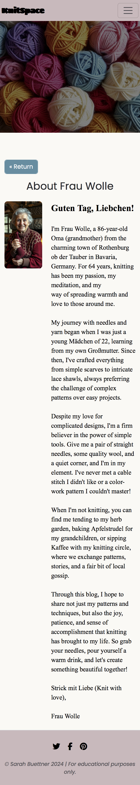
Contact Us |  | 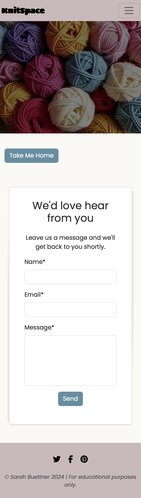
Dashboard |  | 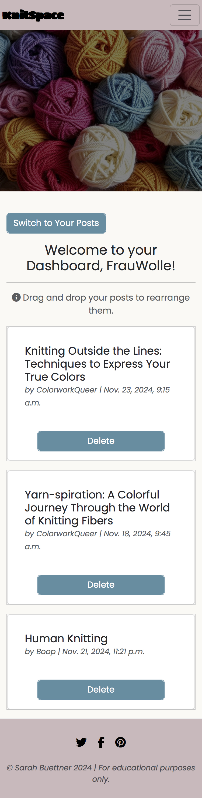
My Posts |  | 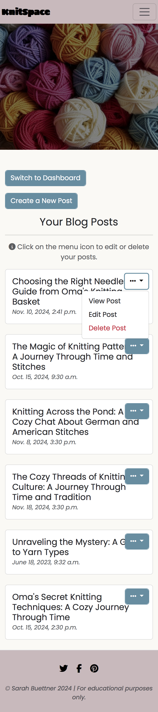
Blog Post View |  | 
Create Post |  | 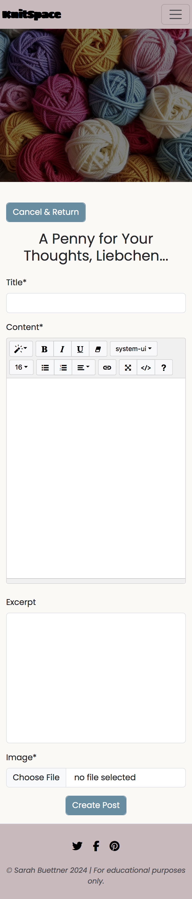
Edit Post | 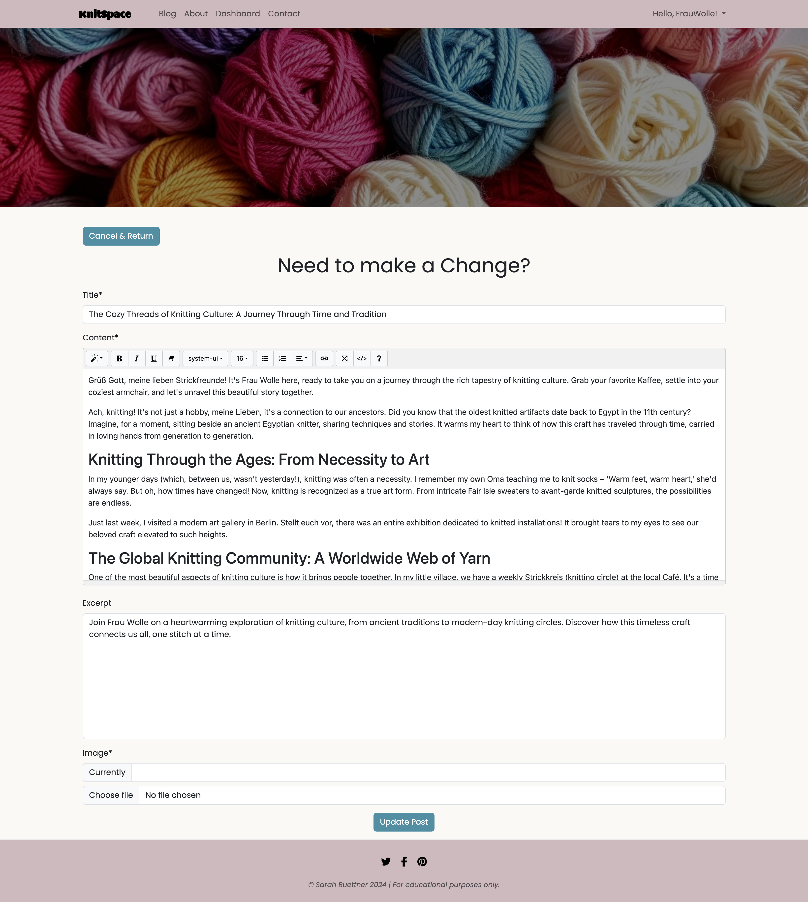 | 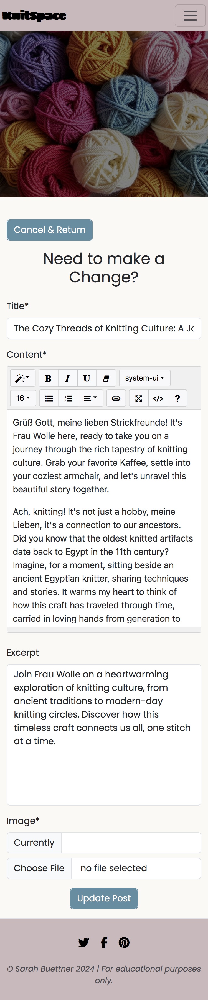
Sign In |  | 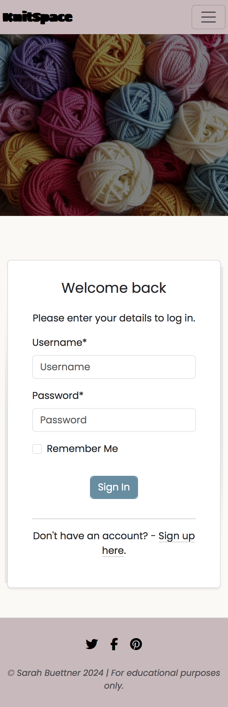
Sign Up |  | 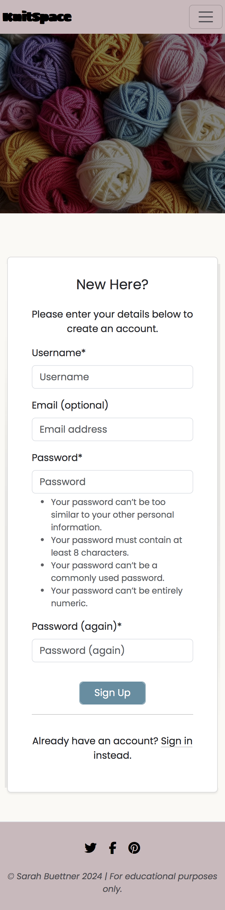
Sign Out |  | 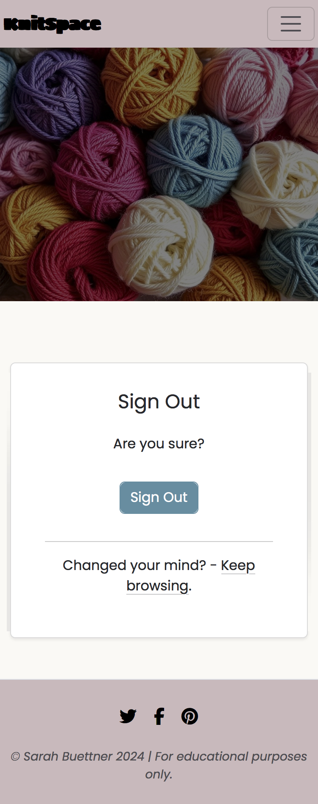
Error Page |  | 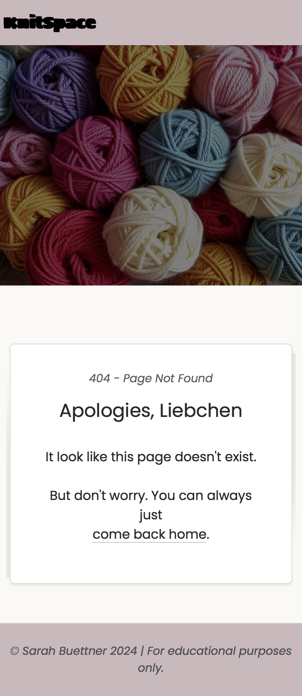

[Back to top ⇧](#knitspace)

## Credits

### Content

All content was written by the developer.

### Media

- The image used for the Favicon is from [Pixabay](https://pixabay.com/), by MissKaLem.
- The default image used for blog posts is from [Pixabay](https://pixabay.com/), by MabelAmber.
- All other images were generated by Alex Büttner using [Getimg.ai](https://getimg.ai/).
- The blog posts and user personas were generated with the help of [Gemini](https://gemini.google.com/). 

### Code

- The models for *BlogPost* and *BlogPostAdmin* were adapted from Code Institute's "I think therefore I blog" walkthrough.
- The Confirmation Modal before deleting a BlogPost was adapted from Code Institute's "I think therefore I blog" walkthrough.
- The basic design and models of the *About* page were adapted from Code Institute's "I think therefore I blog" walkthrough.
- The navigation bar and footer were adapted from [Bootstrap's Clean Blog](https://startbootstrap.com/theme/clean-blog) template.
- The Contact Us functionality was adapted from [Mailtrap](https://mailtrap.io/blog/django-contact-form/).
- The sortable functionality was adapted from [jQuery UI](https://jqueryui.com/sortable/) and [Web Dev Simplified on YouTube](https://www.youtube.com/@WebDevSimplified).
- [Stack Overflow](https://stackoverflow.com/) was consulted regularly.
- Django Tutorials, especially [W3Schools](https://www.w3schools.com/django/) and [Django documentation](https://docs.djangoproject.com/en/5.1/) were consulted regularly.
- Several [YouTube](https://www.youtube.com) channels were consulted for inspiration, especially [Corey Shafer](https://www.youtube.com/@coreyms) and [Codemy](https://www.youtube.com/@Codemycom).
- [Bootstrap 5 Documentation](https://getbootstrap.com) was consulted throughout the project to style the majority of the content.
- [JSHint Docs](https://jshint.com/docs/options/) was consulted for global declarations. 

[Back to top ⇧](#knitspace)

## Acknowledgements

- Code Institute, its tutors, and the Slack community for their support and feedback.
- Marcel, my mentor, for his insights and guidance.
- Nono for repeatedly pointing me in the right direction.
- My husband -  thank you for supporting me throughout the process.

[Back to top ⇧](#knitspace)
