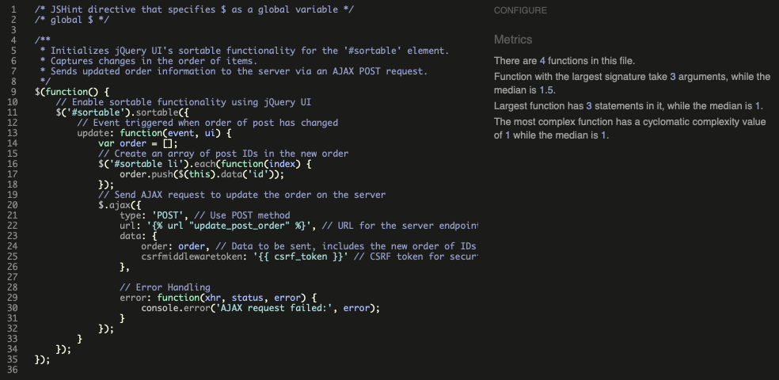

# KnitSpace

KnitSpace is a vibrant online community for knitters of all levels to share, learn, and connect. Users can browse blog posts on various knitting-related topics without logging in. They can also create an account to save their favourite posts or create their own.

Visit the deployed application [here](https://knit-space-57239e7d6ce8.herokuapp.com/).

## Project Planning 

### Agile Methodology

Agile methodology played a crucial role in managing the development process. The project was divided into smaller sprints, each focusing on adding a specific feature or improving an existing function.
The first sprint focused on setting up a basic blog application, which formed the project's foundation. The application allows users to browse through post previews and open the full post by clicking on the preview. Users are not required to log in to the site to view posts. 
The second sprint focused on implementing user authentication. Once implemented, it allows users to create an account using their email address and log into and out of the account. After future sprints, logged-in users will be able to access exclusive areas of the blog.
The third sprint focused on setting up the Dashboard and its functionality. The Dashboard serves as a space for registered users to view their favourite posts. Posts can be saved to and removed from the Dashboard via the click of a button and rearranged with a drag-and-drop feature. Due to time constraints, the functionality to reorder blog posts was moved into the next sprint.
The fourth sprint focused on completing the drag-and-drop functionality and adding additional user functions. Logged-in users can create blog posts, including custom images, and edit and delete their posts after creation.
The fifth sprint focused on adding an *About* page to the blog to allow users to connect with its fictional host.
The sixth sprint focused on enhancing the user experience by improving existing features and addressing issues that had become apparent during testing. Some exmaples include:
- A *My Posts* page was created, allowing users to comfortably manage all their posts in one place.
- Feedback messages afer saving, updating, or deleting a post were added to provide users with immediate fedback to their actions.
- A confirmation modal was added before posts are deleted permanently to avoid any accidental deletions which cannot be undone.

Testing revealed that locating a user’s own posts could proof to be difficult, depending on how many posts that user had authored and how long ago, a *My Posts* page was implemented as a counterpart to the dashboard, allowing users to comfortably manage all their posts in one place. Feedback messages for deleted, saved, and updated posts were implemented.

GitHub Projects was an essential tool for tracking progress and managing tasks throughout the Agile development process. A Kanban-style board was used to visually track progress. Each issue was based on a user story and moved through the different phases of *To Do*, *In Progress*, and *Done*, in accordance with the corresponding sprints. 
Custom labels were created to distinguish the issues visually. Labels were used to assign a priority - *must-have*, *should-have*, *could-have* or *will-not-have*, based on the MOSCOW model of prioritization -  as well as a functionality - *C*, *R*, *U*, or *D*, to reference their role within the *CRUD* functionality.

### CRUD Functionality

*CRUD* functionality has been implemented throughout the project to create an entirely usable experience for the user.

Admin (superuser only)
- *C*: Create new users and posts.
- *R*: Read or view all users and posts.
- *U*: Update posts and user information.
- *D*: Delete posts and users.

Dashboard (logged-in users only)
- *C*: Create a new entry by saving a post to the Dashboard.
- *R*: View all saved posts and open them in full-page view.
- *U*: Update the order of the posts via drag and drop.
- *D*: Delete a post from the Dashboard.

Content Management (logged-in users only)
- *C*: Create a new post.
- *R*: View newly created and previous posts (guest users can view all posts).
- *U*: Update own blogposts.
- *D*: Delete own blogposts.

### Entity Relationship Diagrams

During planning, [Lucidchart](https://www.lucidchart.com) was used to visualize the relationships between the models in this application. The relationships are between *User*, *BlogPost*, and *SavedPost*. *About* is an independent entity with no relation to the other models.

#### User Entity
User -> BlogPost:
- Each User can be the author of multiple *BlogPost* instances. This is represented as a one-to-many (1:N) relationship where the *User* is on the "one" side, and each *BlogPost* is on the "many" side.
- In the model, this relationship is facilitated by a ForeignKey in the *BlogPost* model pointing to the *User*.

User -> SavedPost:
- Each User can save multiple blog posts, resulting in several *SavedPost* entries. This is another one-to-many (1:N) relationship.
- This is implemented via a ForeignKey in the *SavedPost* model pointing back to the User.

#### BlogPost Entity
BlogPost -> User:
- A *BlogPost* is authored by the *User*, which is a many-to-one relationship where multiple *BlogPost* instances can be associated with a single *User*.

BlogPost -> SavedPost:
- Each BlogPost can be saved by multiple users, represented by multiple SavedPost entries. This defines another one-to-many (1:N) relationship, where *SavedPost* serves as an intermediary.

#### SavedPost Entity
BlogPost -> User:
- This is a many-to-one relationship, illustrating that multiple saved posts can belong to a single user.

BlogPost -> SavedPost:
- This is a many-to-one relationship, indicating that multiple users can save the same blog post.

 Entity Relationship Diagrams Image

### Design Choices
#### Color Palette

The color palette makes use of three colors, taken from the header image to maintain a consistent style, as well as standard white. The colors were chosen for their pastel look, to help create a pleasant and soothing experience for the user. Only three colors were used to support that experience. The palette was generated using [Coolors](https://coolors.co/image-picker).
- #FFFFFF (white): Cards and input fields were kept white to stand out.
- #FAF9F6 (baby powder): This was chosen as a background for the site to create a softer look. 
- #CDBABE (thistle): This was chosen for the header and footer to create a visual framing of the page content. 
- #538EA3 (blue / munsell): This was chosen for the buttons of the site.

 Color Pallette Image

#### Typography

Fonts were paired and imported using [Google Fonts](https://fonts.google.com).
*Sigmar* was chosen as the font for the logo and the header text due its bold, decorative lettering. For the main text, *Poppins* was used, as it offers a clean, modern design which is easy to read in a variety of styles and sizes.

 Type Font Image

#### Wireframes

[Balsamiq](https://balsamiq.com/) was used to create wireframes for each page to display their appearance on both mobile and larger devices.

Page | Desktop Version | Mobile Version
--- | --- | ---
Home | --- | ---
Dashboard | --- | ---
Blog Post View | --- | ---
Edit / Create Post | --- | ---
Sign Up / Sign In | --- | ---
404 | --- | ---

[Back to top ⇧](#knitspace)

## User Experience (UX)

### Project Goals

- The project incorporates a responsive design across different devices.
- The project provides an intuitive structure and navigation.
- The project has a pleasant, coherent design that invites users to participate in the community.
- The project allows users to register and access their accounts.
- The project provides exclusive content to registered users.
- The project incorporates full *CRUD* functionality so the user can interact with the content.

### User Stories

#### Blog Accessibility

- As a **guest user**, I can **view blog posts without the need to log in or register** so that **I can freely access content on the site**.
- As a **guest user**, I can **click on a post preview** so that **I can open the full post and read it in detail**.
- As a **registered user**, I can **access exclusive content** so that **I can engage with the community and share information**.

#### Account Management

- As a **guest user**, I can **create an account** so that **I can have a personalized experience and access member-only features.**.
- As a **registered user**, I can **log in to my account** so that **I can access my Dashboard and other member-only features**.
- As a **registered user**, I can **log out of my account** so that **I can ensure my account security and privacy**.

#### Dashboard Management

- As a **registered user**, I can **save posts to my dashboard** so that **I can easily access my favorite content**.
- As a **registered user**, I can **rearrange my saved posts** so that **arrange my content board according to my preferences**.
- As a **registered user**, I can **delete saved blog posts from my Dashboard** so that **I can manage my content board**.
- As a **registered user**, I can **click on a saved post preview** so that **I can open the full post and read it in detail**.

#### Content Management

- As a **registered user**, I can **create a new blog post** so that **I can share my knitting experiences and tips with the community**.
- As a **registered user**, I can **update my existing blog posts** so that **I can correct or update the content I have shared with the community**.
- As a **registered user**, I can **delete my blog posts** so that **I can remove content that I no longer want to share with the community**.
- As a **registered user**, I can **access and manage all my authored posts from a central page** so that **I can efficiently maintain and update my content**.

[Back to top ⇧](#knitspace)

## Features

### General

#### Header and Navigation

The header is the same across all pages to provide users with a familiar layout and allow them to focus on the content of each page. It contains the KnitSpace logo in the top left, doubling as a Home Page link. It also includes links to all website pages across the top, which will take on a different color when active.
The header includes the main background image, which displays a welcome message across the home page, however, this message disappears on the other pages.

 Header Image Guest User

 Header Image Registered User

#### Footer

The footer is the same across pages to provide users with a familiar layout and allow them to focus on the content of each page. It contains links to social media networks, which will open a new tab when clicked, as well as a copyright declaration.

 Footer Image 

### Home Page

The *Home* page previews all available blog posts, ordered from most to least recent. Each post is presented in a clickable card that opens the full-page view. Each card contains an image at the top, which defaults to a preset image unless changed by the user when creating a post, followed by the author and date and, lastly, the excerpt, if available.
Arrows at the bottom of the page allow users to browse between multiple pages.

 Home Page Image 

### Posts

When clicking on a blog post preview card, a full-page view opens. It presents the user with the post's title, author, date, and full text. A *Back* button above the post allows users to return to the *Home* page. Additionally, for logged-in users, a *Save* button above the post allows users to save their favorite posts to their Dashboard. The author of each post also sees a dropdown menu allowing them to edit or delete their posts.

 Post Preview Image

 Full Page Post Image 

### User Dashboard

The Dashboard lets users view all their saved posts in one continuous list. A link to the Dashboard only appears for logged-in users. Each post is presented as a more condensed version of the post preview and will open the full-page post when clicked. Users can delete their saved posts from their Dashboard at any time and rearrange their posts using drag-and-drop functionality.

 Dashboard Image 

### User Authentication

Users can create an account using their email address. Their username must be unique, and the password they choose must meet the standard safety criteria. No verification email is sent out by email.
After successfully creating an account, users can use their credentials to log into the page and access exclusive content, such as their dashboards. Users can log out of their account to return to the guest view when finished.

 Sign Up Image 

 Sign In Image 

 Sign Out Image 

### About Page

The *About* page lets users learn more about Frau Wolle, the face and hands behind KnitSpace. It consists of an image and a short biography which invite users to connect with her.

 About Page Image 

### Future Features

### Comments

### User Profiles

[Back to top ⇧](#knitspace)

## Technologies Used

### Languages

- [HTML5](https://en.wikipedia.org/wiki/HTML5)
- [CSS3](https://en.wikipedia.org/wiki/CSS)
- [Javascript](https://en.wikipedia.org/wiki/JavaScript)
- [Python ](https://en.wikipedia.org/wiki/Python_(programming_language))

### Tools

### Libraries, Frameworks & Packages

- [Django](https://www.djangoproject.com/) was used as web framework.

- [Django Template](https://jinja.palletsprojects.com) was used as a templating language for Django to display backend data to HTML.
   
- [Bootstrap 5](https://getbootstrap.com/docs/5.0/getting-started/introduction/) was used to help with styling and responsiveness.

- [Google Fonts](https://fonts.google.com) was used to import the fonts into the HTML file and use them throughout the site.

- [Font Awesome](https://fontawesome.com) was used throughout the website to add icons for aesthetic and UX purposes. 

- [Django Allauth](https://django-allauth.readthedocs.io/en/latest/) was used for user authentication, registration, and account management.
 
- [Gunicorn](https://gunicorn.org/) was used as a Python WSGI HTTP Server for UNIX to support the deployment of the Django application.  

- [Summernote](https://summernote.org/) was used as a WYSIWYG editor.

- [Heroku Postgres](https://www.heroku.com/postgres) was used in production as a service based on PostgreSQL provided by Heroku.

- [Cloudinary](https://cloudinary.com/) was used as an image storage solution.

- [jQuery](https://jquery.com/) was used as a JavaScript library to simplify the JavaScript code.

- [jQuery UI](https://jqueryui.com/) and [jQuery UI Touch Punch](https://www.drupal.org/project/jquery_ui_touch_punch) were used to implement the drag-and-drop functionality on desktop and mobile devices.

- [Django Crispy Forms](https://django-crispy-forms.readthedocs.io/en/stable/index.html) was used to render the forms.

### Tools and Programs

- [Git](https://git-scm.com) was used for version control. 

- [GitPod](https://gitpod.io/) was used for writing, committing, and pushing code to GitHub.

- [GitHub](https://github.com) was used to store the code. 

- [Heroku](https://www.heroku.com) was used to host and deploy the website.

- [Am I Responsive](ami.responsivedesign.is) was used to preview the website across a variety of popular devices.

- [Coolors](https://coolors.co) was used to create a color palette for the website.

- [JPG2PNG](https://jpg2png.com) was used to convert all images to PNG format.

- [Balsamiq](https://balsamiq.com/) was used to create the wireframes during the design phase of the project

- [Chrome DevTools](https://developer.chrome.com/docs/devtools/) was used for code review and to test responsiveness during the development process.

- [W3C Markup Validator](https://validator.w3.org/) was used to validate the HTML code.

- [W3C CSS Validator](https://jigsaw.w3.org/css-validator/) was used to validate the CSS code.

- [JSHint](https://jshint.com/) was used to validate the JavaScript code.

- [PEP8 Online Check](https://pep8ci.herokuapp.com) was used to validate the Python code.

- [Favicon.cc](https://www.favicon.cc/) was used to create the site favicon.

- [Lighthouse](https://developer.chrome.com/docs/lighthouse/overview) was used to measure the page's quality.

- [CDNJS](https://cdnjs.com/) was used to deliver external libraries on the website.

- [Lucidchart](https://www.lucidchart.com) was used to create the Entity Relationship Diagrams.

[Back to top ⇧](#knitspace)

## Testing

### Testing User Stories

#### Blog Accessibility
As a **guest user**, I can **view blog posts without the need to log in or register** so that **I can freely access content on the site**.
- Blog posts are available without users needing to create an account or log in.
- Previews of each post are available on the home page.
- Navigation on the bottom of the page allows users to browse previews across multiple pages.

As a **guest user**, I can **click on a post preview** so that **I can open the full post and read it in detail**.
- Previews of each post are available on the home page.
- Clicking on a preview opens a full-page view of the post.
- A *Back* button allows users to return to their previous spot after viewing the full-page post.

As a **guest user**, I can **learn about Frau Wolle's knitting journey and experiences** so that **I feel connected to the community and inspired to engage with the content**.
- The *About* page is available to view without needing to create an account or log in.
- Users can learn more about Frau Wolle and her knitting journey by reading her short biography and viewing an image of her.

As a **registered user**, I can **access exclusive content** so that **I can engage with the community and share information**.
- Only registered and logged-in users can access and update their Dashboard.
- Only registered and logged-in users can create, edit, or delete posts.

*Note:* Due to time constraints, the ability for logged-in users to create and edit comments, which was part of this User Story, has not been implemented.

#### Account Management

As a **guest user**, I can **create an account** so that **I can have a personalized experience and access member-only features.**.
- Users can create an account using their email address.
- Users are provided with feedback messages for invalid form inputs.
- Users do not receive a confirmation email after successful registration.

As a **registered user**, I can **log in to my account** so that **I can access my Dashboard and other member-only features**.
- Users can log into their accounts using their username and password.
- Users are redirected to the home page after logging in.
- Logged-in users can access more sites and features than guest users, such as their Dashboard and the ability to create, edit, and delete posts.

As a **registered user**, I can **log out of my account** so that **I can ensure my account security and privacy**.
- Users can log out of their accounts.
- Users need to confirm that they want to log out before being logged out.
- Users are redirected to the home page after logging out.

#### Dashboard Management

As a **registered user**, I can **save posts to my Dashboard** so that **I can easily access my favorite content**.
- A link to the Dashboard is visible in the navigation bar for logged-in users.
- A button to save a blog post is visible on the full-page blog post for logged-in users.
- Once saved, the blog post will appear on the user's Dashboard.
- A feedback message indicates a post has been saved successfully.

As a **registered user**, I can **rearrange my saved posts** so that **arrange my content board according to my preferences**.
- Saved posts are presented as a list.
- Using AJAX drag and drop, users can move their saved posts to a different position.
- The drag and drop functionality is implemented on desktop and mobile devices.

As a **registered user**, I can **delete saved blog posts from my Dashboard** so that **I can manage my content board**.
- A *Delete* button is displayed with each saved blog post preview.
- When clicked, the corresponding blog post is removed from the Dashboard.
- A feedback message indicates a post has been deleted successfully.

As a **registered user**, I can **click on a saved post preview** so that **I can open the full post and read it in detail**.
- Saved blog posts appear as previews on the Dashboard.
- When clicking on the preview, the user is redirected to the full-page view of the post. 
- A *Back* button returns users to their Dashboard from the full-page view.

#### Content Management

As a **registered user**, I can **create a new blog post** so that **I can share my knitting experiences and tips with the community**.
- A form to create a new blog post is available for logged-in users.
- Users can upload an optional image to their post. A placeholder image is provided where users choose not to upload a custom image.
- Users are redirected to the full-page view of their newly created post after successful submission.

As a **registered user**, I can **update my existing blog posts** so that **I can correct or update the content I have shared with the community**.
- Logged-in users see an *Edit* button on posts that they authored.
- After submission, a user feedback message informs users that their post has been updated successfully.
- After submission, users are redirected to the full-page view of their updated post.

As a **registered user**, I can **delete my blog posts** so that **I can remove content that I no longer want to share with the community**.
- Logged-in users see a *Delete* button on posts that they authored.
- After submission, a user feedback message informs users that their post has been deleted successfully.
- After submission, users are redirected to the home page.

As a **registered user**, I can **access and manage all my authored posts from a central page** so that **I can efficiently maintain and update my content**.
-	Users can access a list of all their authored posts from their account drop-down menu. 
-	Users can open, update, or delete each post straight from their post list. 
-	Users can easily switch between views of their authored posts and their saved posts. 

### Code Validation

#### HTML

[W3C Markup Validator](https://validator.w3.org/) was used to validate the HTML code of each templated page.

| **Tested** | **Result** | **View Result** | **Pass** |
--- | --- | --- | ---
|Home | No errors | 

Validation Image

| Pass |
|About | No errors | 

Validation Image

| Pass |
|Dashboard | No errors | 

Validation Image

| Pass |
|My Posts | No errors | 

Validation Image

| Pass |
|Full Page Post View | No errors | 

Validation Image

| Pass |
|Create Post | No errors | 

Validation Image

| Pass |
|Edit Post | No errors | 

Validation Image

| Pass |
|Sign In | No errors | 

Validation Image

| Pass |
|Sign Up | No errors | 

Validation Image

| Pass |
|Sign Out | No errors | 

Validation Image

| Pass |
|404 | No errors | 

Validation Image

| Pass |

#### CSS

[W3C CSS Validator](https://jigsaw.w3.org/css-validator/) was used to validate the custom CSS code.

| Tested | Result | View Result | Pass/Fail |
--- | --- | --- | ---
|style.css | No errors | 

Validation Image

| Pass |

#### JavaScript

[JSHint](https://jshint.com/) was used to validate the custom JavaScript code.

| Tested | Result | View Result | Pass/Fail |
--- | --- | --- | ---
|script.js | No errors | 

Validation Image

| Pass |

#### Python

[PEP8 Online Check](https://pep8ci.herokuapp.com) was used to validate the custom Python code.

| Tested | Result | View Result | Pass/Fail |
--- | --- | --- | ---
|knitspace/settings.py | No errors | 

Validation Image

| Pass |
|knitspace/urls.py | No errors | 

Validation Image

| Pass |
|about/apps.py | No errors | 

Validation Image

| Pass |
|about/urls.py | No errors | 

Validation Image

| Pass |
|about/views.py | No errors | 

Validation Image

| Pass |
|blog/admin.py | No errors | 

Validation Image

| Pass |
|blog/apps.py | No errors | 

Validation Image

| Pass |
|blog/forms.py | No errors | 

Validation Image

| Pass |
|blog/models.py | No errors | 

Validation Image

| Pass |
|blog/urls.py | No errors | 

Validation Image

| Pass |
|blog/views.py | No errors | 

Validation Image

| Pass |
|dashboard/models.py | No errors | 

Validation Image

| Pass |
|dashboard/urls.py | No errors | 

Validation Image

| Pass |
|dashboard/views.py | No errors | 

Validation Image

| Pass |

### Manual Testing

#### Admin Features
| Feature | Tested | Pass/Fail |
|---|---|---|
|Create superuser | Yes | Pass |
|Create user | Yes | Pass |
|Delete user | Yes | Pass |
|Create post | Yes | Pass |
|Delete post | Yes | Pass |
|Upload image | Yes | Pass |
|View all posts | Yes | Pass |
|Filter posts | Yes | Pass |

#### Account Management
| Feature | Tested | Pass/Fail |
|---|---|---|
|Sign up for new account | Yes | Pass |
|Sign in to account | Yes | Pass |
|Sign out of account | Yes | Pass |

#### Content Management
| Feature | Tested | Pass/Fail |
|---|---|---|
|Logged in users can create a new post | Yes | Pass |
|Users can upload a custom image for a post | Yes | Pass |
|Authors can edit their posts | Yes | Pass |
|Authors can delete their posts | Yes | Pass |
|Authors can access all their authored posts in one place | Yes | Pass |

#### Dashboard
| Feature | Tested | Pass/Fail |
|---|---|---|
|Dashboard is only visible to logged-in users | Yes | Pass |
|Saved blog posts appear on the dashboard | Yes | Pass |
|Users can delete posts from the dashboard | Yes | Pass |
|Posts can be rearranged using drag and drop | Yes | Pass |
|New order persists after changing sites and logging out | No | Fail |

#### Home Page & Blog Views
| Feature | Tested | Pass/Fail |
|---|---|---|
|Browse paginated blog excerpts | Yes | Pass |
|Click on excerpt opens full-page blog entry | Yes | Pass |
|Click on back returns the user to the homepage | Yes | Pass |
|Save button on full-page entry is invisible for guest users | Yes | Pass |
|Action button to edit/delete own post on full-page entry is only visible to the author | Yes | Pass |

#### Header
| Feature | Tested | Pass/Fail |
|---|---|---|
|Click on logo returns to homepage | Yes | Successful |
|Click on navigation bar links redirect to other internal pages | Yes | Successful |
|Link to Dashboard is invisible for guest users | Yes | Successful |
|Customized greeting for logged-in users serves as Account drop-down | Yes | Successful |
|Account drop-down instead of customized greeting for guest users | Yes | Successful |
|Active page links change color | Yes | Successful |
|Hero message is only visible on the home page | Yes | Pass |

#### Footer
| Feature | Tested | Pass/Fail |
|---|---|---|
|Click on social media icon redirects to respective website | Yes | Successful |
|Social Media links open in new tab | Yes | Successful |

### Automated Testing

### Device and Browser Testing

#### Device Compatibility
Device | Outcome | Pass/Fail
--- | --- | ---
iPhone 13 Mini | No issues with appearance, responsiveness, or functionality. | ---
iPad 9th Generation | No issues with appearance, responsiveness, or functionality. | ---
MacBook Air 13" | No appearance, responsiveness, or functionality issues. | ---
Acer Predator Helios 300 | No appearance, responsiveness, or functionality issues. | ---
Black Shark PAR-HOA | No issues with appearance, responsiveness, or functionality. | ---
SAMSUNG Galaxy S23 | No issues with appearance, responsiveness, or functionality. | ---

#### Browser Compatibility
Browser | Outcome | Pass/Fail
--- | --- | ---
Safari | No issues with appearance, responsiveness, or functionality. | ---
Google Chrome | No issues with appearance, responsiveness, or functionality. | ---
Microsoft Edge | No issues with appearance, responsiveness, or functionality. | ---
Mozilla Firefox | No issues with appearance, responsiveness, or functionality. | ---
JoyUI Native Browsers | No issues with appearance, responsiveness, or functionality. | ---

### Bugs
|Feature | Bug | Fix |
|---|---|---|
|Hover effect for preview cards | In the deployed version, the preview cards do not appear to lift when hovered over. However, the effect works as expected on the local server. | Fixed |
|Random messages | Feedback messages detailing the last steps a user has taken are shown ahead of the feedback message for saving/deleting a post. | Not fixed |

### Accessibility

[Lighthouse](https://developer.chrome.com/docs/lighthouse/overview) in [Chrome DevTools](https://developer.chrome.com/docs/devtools/) was used to measure the page's quality, focusing on performance, accessibility, best practices, and SEO scores.

| Tested | Result | View Result | Pass/Fail |
--- | --- | --- | :---:
|Home | No errors | 

Lighthouse Image

| Pass |
|About | No errors | 

Lighthouse Image

| Pass |
|Dashboard | No errors | 

Lighthouse Image

| Pass |
|Full Page Post View | No errors | 

Lighthouse Image

| Pass |
|Create Post | No errors | 

Lighthouse Image

| Pass |
|Edit Post | No errors | 

Lighthouse Image

| Pass |
|Sign In | No errors | 

Lighthouse Image

| Pass |
|Sign Up | No errors | 

Lighthouse Image

| Pass |
|Sign Out | No errors | 

Lighthouse Image

| Pass |
|404 | No errors | 

Lighthouse Image

| Pass |

[Back to top ⇧](#knitspace)

## Deployment

### GitHub

This website was developed using [GitPod](https://www.gitpod.io/), which was then committed and pushed to [GitHub](https://github.com/) using the GitPod terminal.

Here are the steps to deploy a website to GitHub Pages from its GitHub repository:

1. Log in to GitHub and locate the [GitHub Repository](https://github.com/).
2. At the top of the Repository, locate the Settings button on the menu.
3. Scroll down the Settings page until you locate the Pages section.
4. Under Source, click the *None* dropdown and select *Master Branch*.
5. The page will refresh automatically and generate a link to your website.

### Heroku

Deployment to [Heroku](https://www.heroku.com) was completed using the following steps:

1. Prepare for deployment.
    - Create an env.py file in your main directory and add *DATABASE_URL*, *CLOUDINARY_URL*, and *SECRET_KEY*.
    - Import *DATABASE_URL* and *SECRET_KEY* into your *settings.py* file, and remove the default database confihuration.
    - Add your apps to the list of *Installed Apps* in *settings.py*.
    - Add Heroku to the *ALLOWED_HOSTS* list in *settings.py*.
    - Create a file named *Procfile* in your main directory, and add a command to execute your project.
    - Create a file named *python-version* in your main directory, and add the version of Python you are using.
    - Install *gunicorn* and *whitenoise* to virtual environment.
    - Update the *requirements.txt* file.
    - Change your *settings.py* file to read *DEBUG = FALE*.
2. Create a new App.
    - Log in to Heroku and click *Create New App* from the Dashboard.
    - Enter a unique app name and choose your region.
    - Click *Create App*.
3. Update your *ConfigVars*.
    - Go to *Settings* > *Reveal ConfigVars* and update the following information:
        - SECRET_KEY
        - DATABASE_URL
4. Deploy the project.
    - Go to *Deploy* and specify deployment details.
    - Select *GitHub* as the *Deployment Method*.
        - When prompted to *Connect to GitHub*, find your repository and click *Connect*.
    - Select either *Automatic Deploys* or *Manual Deploys* and click *Deploy Branch*.
5. Once deployment is complete, click *View* for the deployed project. 

 
[Back to top ⇧](#knitspace)

## Credits

### Content

All content was written by the developer.

### Media

- The image used for the Favicon is from [Pixabay](https://pixabay.com/), by MissKaLem.
- The default image used for blog posts is from [Pixabay](https://pixabay.com/), by MabelAmber.
- All other images were generated by Alex Büttner using [Getimg.ai](https://getimg.ai/).
- The blog posts and user personas were generated with the help of [Gemini](https://gemini.google.com/). 

### Code

- The models for *BlogPost* and *BlogPostAdmin* were adapted from Code Institute's "I think therefore I blog" walkthrough.
- The Confirmation Modal before deleting a BlogPost was adapted from Code Institute's "I think therefore I blog" walkthrough.
- The basic design of the *About* page was adapted from Code Institue's "I think therefore I blog" walkthrough.
- The navigation bar and footer were adapted from [Bootstrap's Clean Blog](https://startbootstrap.com/theme/clean-blog) template.
- The sortable functionality was adapted from [jQuery UI](https://jqueryui.com/sortable/).
- Django Tutorials, especially [W3Schools](https://www.w3schools.com/django/), [Django documentation](https://docs.djangoproject.com/en/5.1/) were consulted regularly.
- Several [Youtube](https://www.youtube.com) channels were consulted for inspiration, especially [Corey Shafer](https://www.youtube.com/@coreyms) and [Codemy](https://www.youtube.com/@Codemycom).
- [Bootstrap 5 Documentation](https://getbootstrap.com) was consulted throughout the project to style the majority of the content.

[Back to top ⇧](#knitspace)

## Acknowledgements

- Code Institute, its tutors, and the Slack community for their support and feedback.
- Marcel, my mentor, for his insights and guidance.
- Nono for repeatedly pointing me in the right direction.
- My husband, thank you for supporting me throughout the process.

[Back to top ⇧](#knitspace)

